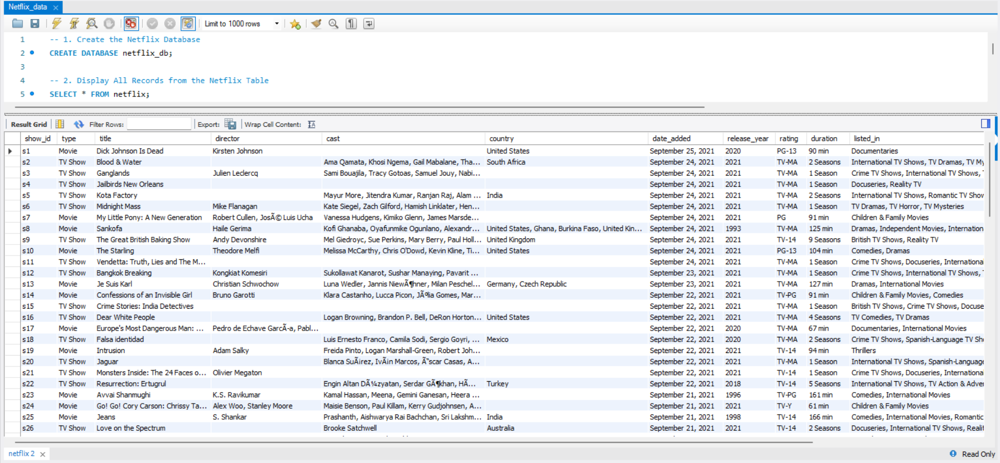
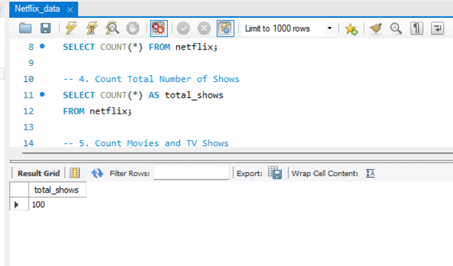
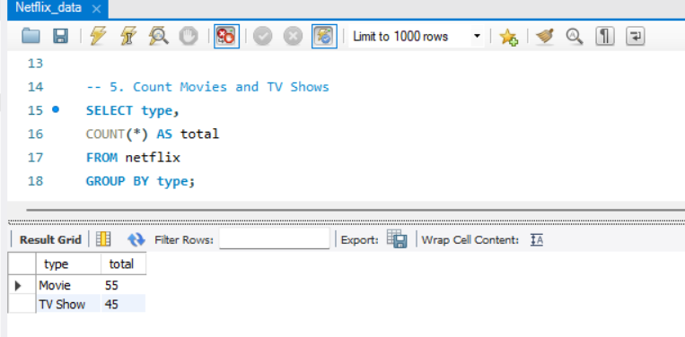
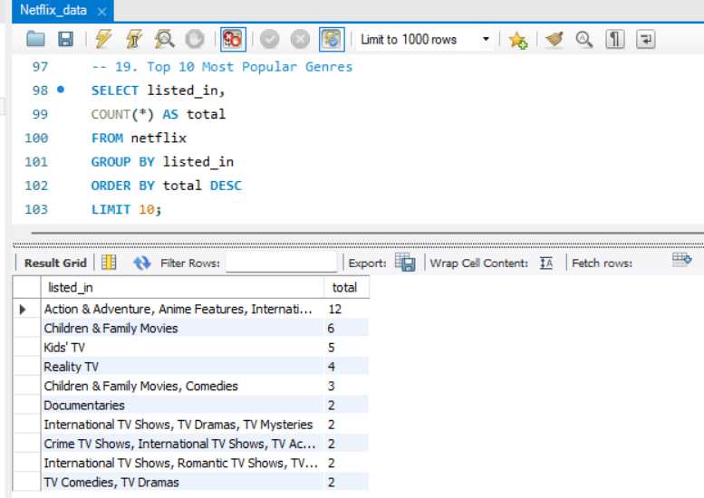

# 🎬 Netflix SQL Data Analysis

A SQL project that explores and analyzes the Netflix dataset using MySQL. This project demonstrates database creation, SQL querying, and extracting insights from real-world data.

---

## 📌 Project Overview

The goal of this project is to practice SQL by analyzing Netflix movies and TV shows. It covers essential SQL concepts such as filtering, grouping, aggregation, and sorting.

---

## 🛠️ Technologies Used

- MySQL
- MySQL Workbench
- SQL
- Git
- GitHub

---

## 📂 Project Structure

```
Netflix-SQL-Data-Analysis/
│── images/
│── Netflix_data.sql
│── README.md
```

---

## 📊 Dataset

The dataset contains information about Netflix titles including:

- Title
- Type
- Director
- Country
- Release Year
- Rating
- Duration
- Listed In
- Description

---

## 📸 Project Screenshots

### Database


---

### Netflix Table



---

### Total Shows



---

### Movies vs TV Shows



---

### Top 10 Most Popular Genres



---

## 🔍 SQL Concepts Used

- CREATE DATABASE
- SELECT
- WHERE
- GROUP BY
- ORDER BY
- COUNT()
- MAX()
- MIN()
- Aggregate Functions

---

## 📜 Sample Queries

### Count Total Shows

```sql
SELECT COUNT(*) AS total_shows
FROM netflix;
```

### Count Movies and TV Shows

```sql
SELECT type,
       COUNT(*) AS total
FROM netflix
GROUP BY type;
```

### Top 10 Most Popular Genres
```sql
SELECT listed_in,
COUNT(*) AS total
FROM netflix
GROUP BY listed_in
ORDER BY total DESC
LIMIT 10;
---

## 🎯 Learning Outcomes

- Created a SQL database
- Imported a real-world dataset
- Performed data analysis using SQL
- Used aggregate functions and grouping
- Improved SQL problem-solving skills

---

## 🚀 Future Improvements

- Advanced SQL queries
- Window functions
- Common Table Expressions (CTEs)
- Stored Procedures
- Data Visualization using Power BI

---

## 👨‍💻 Author

**Arif Khan**

If you found this project helpful, consider giving it a ⭐ on GitHub!
